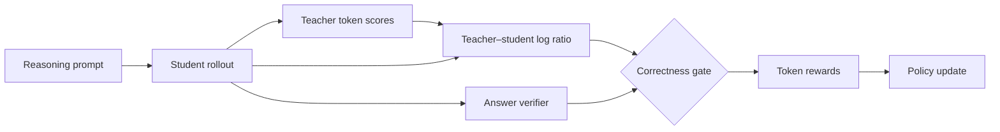

<div align="center">

# VeriGate

### Verifier-Gated On-Policy Distillation for Reasoning Models

**Dense teacher guidance. Verifiable outcome feedback. One consistent reward.**

Training &nbsp; / &nbsp; Controlled baselines &nbsp; / &nbsp; Group-relative scaling

[Quick start](#quick-start) · [Method](#method) · [Experiments](#experiments) · [Reproducibility](docs/REPRODUCIBILITY.md)

</div>

---

VeriGate combines token-level teacher guidance with response-level verification. A student generates its own trajectories, a teacher scores the tokens, and a verifier gates the resulting distillation rewards according to answer correctness.

One shared launcher provides the gated method, an ungated baseline, a group-relative variant, and an inverse-gate ablation. This release packages the supplied implementation under a new project name; the rename does not imply a new algorithm or newly reproduced results.

## Method



For a sampled token, define

$$d_t = \log \pi_T(o_t\mid q,o_{<t}) - \log \pi_\theta(o_t\mid q,o_{<t}).$$

Given verifier score $s$ and threshold $\tau$, the default gate applies

$$r_t = \begin{cases}\max(d_t,0), & s>\tau,\\\min(d_t,0), & s\leq\tau.\end{cases}$$

Correct responses retain non-negative distillation rewards; incorrect responses retain non-positive rewards. This describes reward signs, not a guarantee about every parameter update. The top-k variant gates weighted distillation rewards.

Group-relative scaling subsequently multiplies rewards by $|A_i|+u$, where $A_i$ is a within-prompt outcome advantage. With $u=0$, uniform groups receive zero scaling.

## Quick start

**Training target:** Linux, Bash, Python 3.12, and compatible NVIDIA CUDA GPUs. The inherited configuration requests **8 GPUs**. Required memory depends on models, sequence lengths, and parallelism; minimum GPU memory has not been measured here.

### 1. Install

From the repository root:

```bash
conda create -n verigate python=3.12 -y
conda activate verigate
cd verl
USE_MEGATRON=0 USE_SGLANG=0 bash scripts/install_vllm_sglang_mcore.sh
python -m pip install -e '.[math]'
python -m pip check
cd ..
```

The bundled installer targets vLLM 0.11.0 and a Linux CPython 3.12 / CUDA 12 / Torch 2.8 FlashAttention wheel. Check compatibility with your machine. It downloads dependencies and is not a fully pinned environment specification.

### 2. Set explicit checkpoints

```bash
export ACTOR_MODEL_PATH=/absolute/path/to/student
export REWARD_MODEL_PATH=/absolute/path/to/teacher
```

Model IDs are also accepted. Use compatible tokenizer vocabularies and chat templates. `REWARD_MODEL_PATH` identifies the **teacher**; task verification is implemented separately. No personal machine paths or unverified checkpoint IDs are embedded in the launcher.

### 3. Inspect and train

```bash
# Print the command without loading models or starting Ray.
DRY_RUN=1 bash verigate.sh

# Choose an experiment.
bash verigate.sh
bash group.sh
bash baseline.sh
bash ablation_inverse.sh
```

The launcher uses your active environment and lets the trainer initialize Ray. Logs go to the console by default; enable experiment tracking with `LOGGER='["console","wandb"]'`.

## Experiments

| Preset | Entry point | Gate | Group scaling | Responses |
| :-- | :-- | :-- | :-- | --: |
| VeriGate | `verigate.sh` | Default | Off | 1 |
| Group-relative | `group.sh` | Default | On, normalized by std | 8 |
| Ungated baseline | `baseline.sh` | Off | Off | 1 |
| Inverse ablation | `ablation_inverse.sh` | Inverse | Off | 1 |

Explicit environment variables override preset defaults. The group preset preserves the supplied script's `GRPO_NORM_BY_STD=True`; use `False` for centered advantages without standard-deviation normalization.

```bash
GRPO_NORM_BY_STD=False bash group.sh
LOG_PROB_TOP_K=64 bash verigate.sh
NGPUS_PER_NODE=4 MINI_BATCH_SIZE=128 bash verigate.sh
bash verigate.sh trainer.total_epochs=1 trainer.test_freq=10
```

Changing GPU count may require additional memory and parallelism adjustments. A dry run validates command construction only.

| Variable | Default | Purpose |
| :-- | :-- | :-- |
| `LOG_PROB_TOP_K` | `0` | Sampled-token rewards; positive values enable top-k |
| `CORRECTNESS_THRESHOLD` | `0.0` | Correct iff summed verifier score exceeds threshold |
| `GRPO_SCALE_BASELINE` | `0.0` | Additive floor in group scaling |
| `MAX_PROMPT_LENGTH` / `MAX_RESP_LENGTH` | `1024` / `8192` | Token budgets |
| `MINI_BATCH_SIZE` | `256` | Actor minibatch size |
| `PARALLEL_SIZE` | `1` | Sequence / tensor parallelism setting |
| `ACTOR_LR` | `1e-6` | Learning rate |
| `TEST_FREQ` / `SAVE_FREQ` | `22` / `55` | Validation / checkpoint interval |
| `TOTAL_EPOCHS` | `3` | Training epochs |
| `FINAL_CKPT_DIR` | `checkpoints/<experiment>` | Output directory |

### Evaluation and results

Validation runs inside the trainer with 16 sampled responses per prompt. The original project describes the supplied validation set as 1,590 problems across AIME24, AIME25, AMC, MATH-500, Minerva, and OlympiadBench.

See [recorded benchmark tables](docs/RESULTS.md) for the supplied avg@16 numbers. These are historical records, **not results reproduced by this cleanup**. Report exact checkpoints, seeds, hardware, and raw logs before drawing new experimental conclusions. A standalone offline evaluation harness is not included.

## Repository map

```text
VeriGate/
├── verigate.sh                 # Main method
├── group.sh                    # Group-relative variant
├── baseline.sh                 # Ungated baseline
├── ablation_inverse.sh         # Complementary gate ablation
├── scripts/train.sh            # Shared training launcher
├── scripts/inspect_data.py     # Dataset hashes and optional schema inspection
├── tests/test_launcher.py      # CPU-only regression checks
├── datasets/                   # Supplied parquet files and hash manifest
├── docs/                       # Results and reproducibility notes
└── verl/                       # Training framework and its notices
```

The reward gate and group scaling live in [`ray_trainer.py`](verl/verl/trainer/ppo/ray_trainer.py), under `correctness_gated` and `grpo_scaled`. Configuration lives in [`rollout.py`](verl/verl/workers/config/rollout.py).

## Development

```bash
python -m unittest discover -s tests -v
python scripts/inspect_data.py
```

Launcher tests require Bash but no CUDA, Torch, or Ray. They do not replace distributed training tests. See [reproducibility notes](docs/REPRODUCIBILITY.md) for validation scope.

## Licensing

The vendored framework retains its [license](verl/LICENSE) and [notices](THIRD_PARTY_NOTICES.md). Model and dataset terms are separate. No blanket license is assigned to components without existing license metadata.
