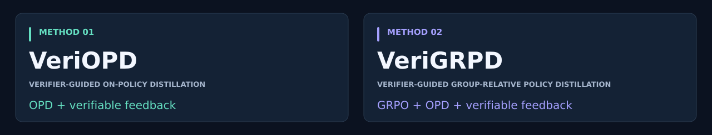
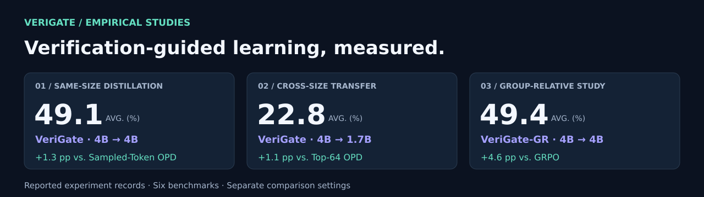

<p align="center">
  
</p>

<p align="center">
  <strong>VeriOPD &amp; VeriGRPD</strong><br>
  <sub>On-policy distillation, guided by verifiable feedback.</sub>
</p>

<p align="center">
  <a href="#method-family">Methods</a> ·
  <a href="#reported-benchmark-results">Results</a> ·
  <a href="#the-method">Direct OPD</a> ·
  <a href="#quick-start">Quick start</a> ·
  <a href="#controlled-experiments">Experiments</a> ·
  <a href="#evaluation">Evaluation</a> ·
  <a href="docs/DIRECT_OPD.md">Technical guide</a>
</p>

<p align="center">
  <strong>Python 3.10+</strong> &nbsp; / &nbsp; PyTorch &nbsp; / &nbsp; Dense Qwen2 &amp; Qwen3 &nbsp; / &nbsp; Research implementation
</p>

---

**VeriGate studies where to place supervision in direct on-policy distillation.** The student generates its own responses. A frozen teacher provides a full next-token distribution at each prefix. Detached ordinal weights allocate a unit coefficient sum across each response, and the student directly minimizes weighted forward KL.

> [!NOTE]
> **Two research tracks:** The reported experiments below study verifier-gated distillation and its group-relative extension. The current direct-KL ordinal trainer has CPU mathematical and integration checks; its full-model GPU benchmarks remain unvalidated.

| Student-generated contexts | Deliberate allocation | Auditable learning |
| :-- | :-- | :-- |
| Refresh student prefixes at every optimizer update. | Compare rank, magnitude, and uniform weights at the same coefficient sum. | Optimize direct KL; retain evaluation evidence and verify answers offline. |

## Method family



**VeriOPD** — Verifier-Guided On-Policy Distillation.

**VeriGRPD** — Verifier-Guided Group-Relative Policy Distillation.

<!-- reported-results:start -->
## Reported benchmark results



**Six mathematics benchmarks · Four controlled comparisons**

Scores below are transcribed from the supplied experiment records. **Bold** marks the best score among trained student methods within each table, including ties; the initial student and teacher are reference rows. `Avg.` preserves the reported average.

> These records evaluate the verifier-gated method family. They are not benchmark measurements of the current direct-KL ordinal trainer. [Protocol and source notes](docs/RESULTS.md#reporting-notes).

### 01 · Same-size distillation

**Teacher:** Qwen3-4B-RL → **Student:** Qwen3-4B

| Method | AIME24 | AIME25 | AMC | MATH500 | Minerva | OlympiadBench | Avg. |
| :-- | --: | --: | --: | --: | --: | --: | --: |
| Student | 24.00 | 15.80 | 60.80 | 80.90 | 27.60 | 42.90 | 42.00 |
| Teacher | 36.00 | 29.00 | 65.90 | 87.00 | 35.40 | 49.30 | 50.40 |
| Sampled-Token OPD | 34.20 | 26.00 | 63.10 | **85.50** | 31.60 | 46.50 | 47.80 |
| Top-64 OPD | 34.60 | 23.50 | 62.00 | 85.00 | 32.20 | 46.80 | 47.40 |
| **VeriOPD** | **36.90** | **28.10** | **64.80** | 84.70 | **33.20** | **47.00** | **49.10** |

VeriOPD reaches **49.1** reported average: **+1.3 points** over Sampled-Token OPD and **+1.7 points** over Top-64 OPD. It leads the trained student methods on five of six benchmarks; Sampled-Token OPD retains the highest MATH500 score.

### 02 · Cross-size transfer

**Teacher:** Qwen3-4B-Base-RL → **Student:** Qwen3-1.7B-Base

| Method | AIME24 | AIME25 | AMC | MATH500 | Minerva | OlympiadBench | Avg. |
| :-- | --: | --: | --: | --: | --: | --: | --: |
| Student | 4.10 | 1.70 | 23.20 | 48.90 | 8.90 | 17.10 | 17.30 |
| Teacher | 10.60 | 13.10 | 40.30 | 74.20 | 17.20 | 30.00 | 30.90 |
| Sampled-Token OPD | 6.50 | 2.10 | 24.80 | 59.10 | 11.50 | 21.60 | 20.90 |
| Top-64 OPD | **8.50** | **3.30** | 26.40 | 60.10 | 10.70 | 21.40 | 21.70 |
| **VeriOPD** | **8.50** | **3.30** | **30.30** | **60.80** | **11.60** | **22.00** | **22.80** |

VeriOPD reaches **22.8**, improving on the initial student by **5.5 points** and Top-64 OPD by **1.1 points**. It matches or exceeds both distillation baselines on every benchmark.

### 03 · Group-relative extension

**Teacher:** Qwen3-4B-RL → **Student:** Qwen3-4B

| Method | AIME24 | AIME25 | AMC | MATH500 | Minerva | OlympiadBench | Avg. |
| :-- | --: | --: | --: | --: | --: | --: | --: |
| Student | 24.00 | 15.80 | 60.80 | 80.90 | 27.60 | 42.90 | 42.00 |
| Teacher | 36.00 | 29.00 | 65.90 | 87.00 | 35.40 | 49.30 | 50.40 |
| GRPO | 28.30 | 20.80 | 62.30 | 83.90 | 28.90 | 44.60 | 44.80 |
| OPD | 32.00 | **31.70** | 65.60 | 85.40 | 28.90 | 46.60 | 48.40 |
| **VeriGRPD** | **34.80** | **31.70** | **67.00** | **85.60** | **30.50** | **47.00** | **49.40** |

VeriGRPD reaches **49.4**: **+4.6 points** over GRPO and **+1.0 point** over the OPD baseline in this study. It leads or ties the trained student methods across all six benchmarks.

### 04 · Gate-direction ablation

**Teacher:** Qwen3-4B-RL → **Student:** Qwen3-4B

| Method | AIME24 | AIME25 | AMC | MATH500 | Minerva | OlympiadBench | Avg. |
| :-- | --: | --: | --: | --: | --: | --: | --: |
| Student | 24.00 | 15.80 | 60.80 | 80.90 | 27.60 | 42.90 | 42.00 |
| Teacher | 36.00 | 29.00 | 65.90 | 87.00 | 35.40 | 49.30 | 50.40 |
| OPD | 34.20 | 26.00 | 63.10 | **85.50** | 31.60 | 46.50 | 47.80 |
| **VeriOPD** | **36.90** | **28.10** | **64.80** | 84.70 | **33.20** | **47.00** | **49.10** |
| Inverse-Gated | 30.30 | 21.20 | 62.30 | 83.60 | 27.70 | 42.80 | 44.60 |

Reversing the gate reduces the reported average from **49.1 to 44.6** (**−4.5 points**), below the OPD baseline of **47.8**. This comparison supports the role of gate direction in the supplied experiment.

[Experiment records and reporting notes →](docs/RESULTS.md) · [Machine-readable scores →](docs/results/reported-results.json)
<!-- reported-results:end -->

## The method


### From disagreement to supervision

For every valid response position, compute **teacher-to-student forward KL over the full vocabulary**. Rank positive detached disagreements using average ranks for ties, normalize the ranks, then mix with uniform weights to control concentration. Empty positive support falls back to uniform allocation.

<p align="center">
  
</p>

Here, `N` is the number of responses, `i` indexes responses, `t` indexes valid positions, and `sg` means stop-gradient. **Only the student receives gradients.** In words: average the weighted token-level KL sums across responses.

The coefficient budget is fixed. **Loss values and gradient norms are not fixed.** Invariance applies to the ranking-based allocation, not to the whole objective when teacher probabilities change.

| Design choice | What it does |
| :-- | :-- |
| **Full-distribution feedback** | Computes forward KL over the entire shared vocabulary |
| **Average-rank allocation** | Preserves order and ties while discarding numerical score gaps |
| **Unit coefficient sum** | Separates allocation from changes in total weighting coefficient |
| **Concentration constraint** | Sets the smallest uniform mixture meeting an effective-fraction target |
| **Direct gradient** | Backpropagates through student probabilities, with teacher and weights detached |
| **Fresh contexts** | Samples new student responses before each optimizer update |

<details>
<summary><strong>Why the concentration setting is 0.9</strong></summary>

With untied, full-support ranks, the effective-token fraction is already above 0.75. A 0.25 target would be inactive. The planned main setting uses 0.9, with a 0.05 uniform floor.

For long untied responses, the required mixture approaches 0.423. It can therefore behave almost like fixed smoothing. The experiment plan explicitly includes a fixed 0.425 mixture; adaptation itself is not assumed to be an innovation or a benefit.

</details>

## Quick start

### 1. Install and inspect

Use **Python 3.10+**. Run the shell examples in Bash from the repository root.

```bash
git clone https://github.com/tjucrush/VeriGate.git
cd VeriGate
pip install -r requirements-opd.txt
```

```bash
# Dependency-free configuration preview. No model loads or training.
python -m verigate.train --dry-run
DRY_RUN=1 bash scripts/train.sh rank
```

### 2. Point to models and training data

Configure a compatible dense Qwen teacher and student with a shared vocabulary:

```bash
export ACTOR_MODEL_PATH=/models/Qwen3-1.7B
export REWARD_MODEL_PATH=/models/Qwen3-4B

# Supply an audited training-only split.
TRAIN_DATASET=/data/train.jsonl bash scripts/train.sh rank
```

Use JSON/JSONL or Parquet containing a `prompt` field. Prompts may be text or chat messages ending in a user turn. The training path reads prompt text only and filters overlength prompts.

### 3. Scale to multiple GPUs

For replicated data parallelism:

```bash
torchrun --standalone --nproc_per_node=4 -m verigate.train \
  --student "$ACTOR_MODEL_PATH" --teacher "$REWARD_MODEL_PATH" \
  --train-data /data/train.jsonl --allocation rank \
  --prompts-per-update 32 --output checkpoints/rank-seed0
```

Each worker holds a complete teacher, student, gradients, and optimizer states. Choose hardware accordingly; this entry does not implement model sharding. Projection chunking reduces vocabulary-activation memory, not model-state memory.

<details>
<summary><strong>Configuration reference — defaults and runtime settings</strong></summary>

<br>

| Option | Default |
| :-- | :-- |
| `--allocation` | `rank` |
| `--floor` / `--min-fraction` | `0.05` / `0.9` |
| `--prompts-per-update` | `32` globally |
| `--prompt-batch-size` | `1` per worker |
| `--responses-per-prompt` | `1` |
| `--steps` | `200` |
| `--learning-rate` | `1e-6` |
| `--max-prompt-length` / `--max-response-length` | `1024` / `8192` |
| `--logit-chunk-size` | `64` valid positions, full vocabulary |
| `--precision` | bf16 autocast; fp32 student parameters and Adam states |
| `--save-every` | `50` updates |
| `--enable-thinking` | Off; use consistently for training and evaluation |

</details>

## Controlled experiments

**One objective. Four allocation rules. Matched teacher access.**

| Allocation | Research question | Launch |
| :-- | :-- | :-- |
| **Uniform** | Does nonuniform supervision help? | `bash scripts/train.sh uniform` |
| **Magnitude** | Do numerical disagreement gaps help? | `bash scripts/train.sh magnitude` |
| **Rank** | Is ordinal disagreement sufficient? | `bash scripts/train.sh rank` |
| **Shuffled rank** | Does the position of the weight matter? | `bash scripts/train.sh rank-shuffled` |

```bash
# Print a matched multi-seed plan. This does not start training.
python scripts/run_ablation.py --output outputs/direct-opd-plan.json

# Optional controls: no constraint, fixed smoothing, and concentration endpoints.
python scripts/run_ablation.py \
  --variants rank rank-no-ess rank-fixed425 rank-fixed50 rank-ess100
```

The planner requires `--execute` to run jobs. Uniform direct OPD is one baseline, not two differently named copies. All comparisons use the same divergence direction and teacher access.

## Evaluation

Generate predictions separately from training, then apply answer verification offline:

```bash
python -m verigate.evaluate --model checkpoints/rank-seed0/step-200 \
  --data /data/holdout.jsonl --answer-column answer \
  --samples 16 --output outputs/holdout-predictions.jsonl

pip install "math-verify[antlr4_13_2]"
python -m verigate.score --predictions outputs/holdout-predictions.jsonl \
  --samples 16 --output outputs/holdout-scores.json
```

Evaluation preserves raw predictions, sample IDs, prompt hashes, lengths, truncation flags, and reference answers. The scorer checks sample completeness and reports per-benchmark avg@N, macro average, and parsing failures. Audit the verifier and dataset before using scores in a paper. Tune on the training-source holdout; reserve final benchmarks for final evaluation.

## Reproducibility

```bash
python -m unittest discover -s tests -v
```

The direct path includes checks for full-vocabulary KL gradients, dense/chunked equivalence, detached targets, allocation properties, EOS masks, safe experiment plans, and tiny model integration. Optional random Qwen2/Qwen3 CPU tests exercise the actual Transformers decoder interface without downloading weights.

| Artifact | Purpose |
| :-- | :-- |
| `run.json` | Resolved arguments, model revisions, data hash, vocabulary hash, software versions |
| `metrics.jsonl` | Weighted/uniform KL, allocation diagnostics, tokens, gradient norm, timing |
| `step-N/` | Student and tokenizer checkpoint |
| Evaluation JSONL | Sample-level evidence retained for auditing and paired comparisons |

### Go deeper

| Guide | What you will find |
| :-- | :-- |
| [Method and mathematical contract](docs/DIRECT_OPD.md) | Exact objective, allocation properties, model support, and limitations |
| [Reproducibility guide](docs/REPRODUCIBILITY.md) | Experiment setup and reproducibility conventions |
| [Third-party notices](THIRD_PARTY_NOTICES.md) | Attribution for bundled components |

<details>
<summary><strong>Repository layout and compatibility</strong></summary>

```text
verigate/                   Direct KL, allocation, trainer, evaluation
scripts/train.sh            Public direct-OPD launcher
scripts/run_ablation.py     Direct-OPD experiment plans
tests/test_direct_*.py      Direct-objective and adapter checks
docs/DIRECT_OPD.md          Mathematical and runtime contract
verl/                       Bundled research framework
```

The public direct path does not import the bundled policy-optimization framework. Earlier policy experiments remain in explicitly named archive launchers for reproducibility; they are not dependencies of the direct objective.

</details>

---

<p align="center">
  <strong>Where supervision goes is a research question.</strong><br>
  <sub>Measure ordering. Match coefficients. Verify outcomes.</sub>
</p>
