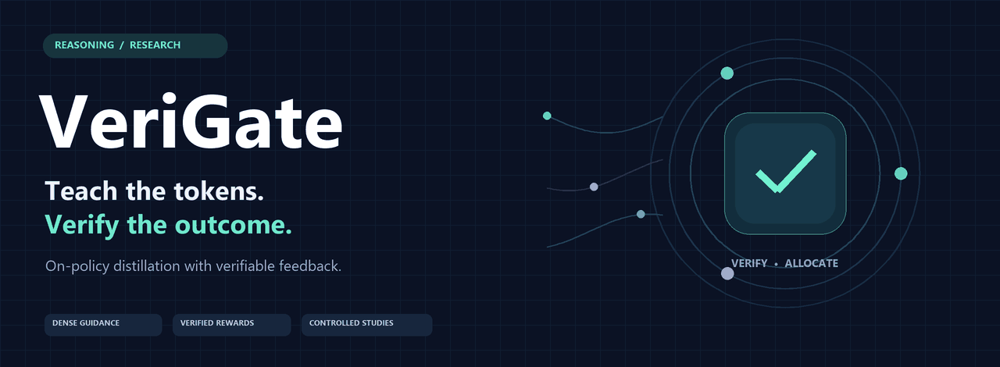
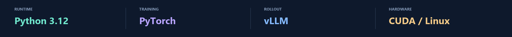
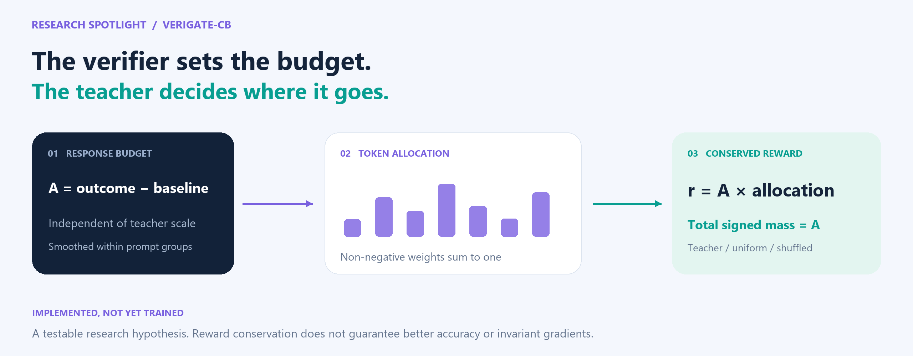
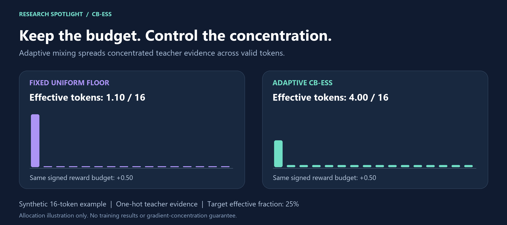
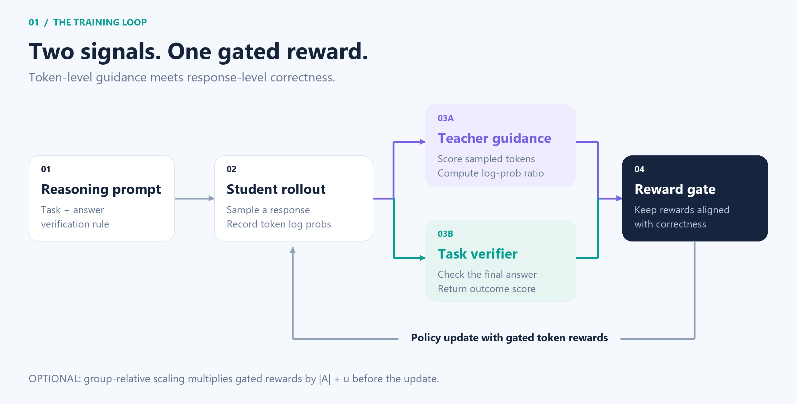
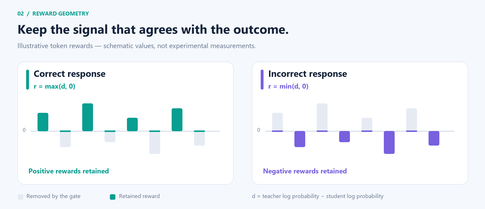
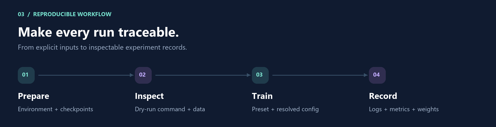
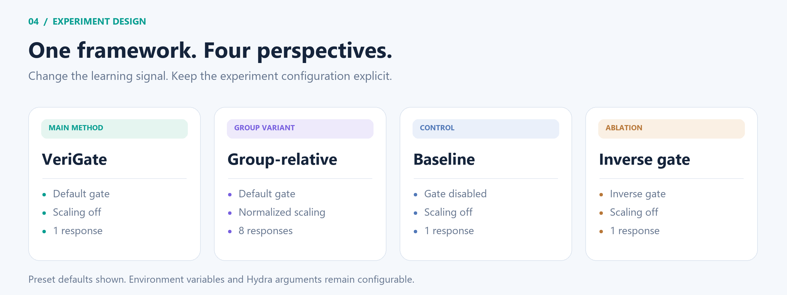
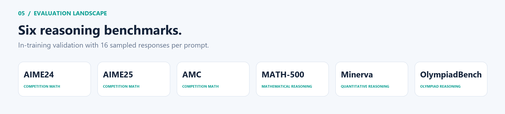

<div align="center">

<picture>
  <source media="(prefers-reduced-motion: reduce)" srcset="docs/assets/cover.png">
  
</picture>

<br>

**A research toolkit for learning from teacher guidance and verifiable outcomes.**

[🔬 Research](#research-spotlight) &nbsp; · &nbsp; [🧠 Method](#method) &nbsp; · &nbsp; [🚀 Quick start](#quick-start) &nbsp; · &nbsp; [🧪 Experiments](#experiments) &nbsp; · &nbsp; [📊 Results](docs/RESULTS.md)

<sub>[Static cover](docs/assets/cover.png) &nbsp; · &nbsp; [Reproducibility guide](docs/REPRODUCIBILITY.md) &nbsp; · &nbsp; [Conserved-budget design](docs/CONSERVED_BUDGET.md)</sub>

<br>



</div>

<br>

VeriGate combines **token-level teacher guidance** with **response-level verification**. The student samples its own reasoning trajectories; a correctness gate filters distillation rewards before the policy update.

<table>
<tr>
<td width="33%" valign="top">
<strong>🧠 &nbsp; Dense guidance</strong><br><br>
Teacher–student log ratios provide feedback at the token level.
</td>
<td width="33%" valign="top">
<strong>✓ &nbsp; Verified outcomes</strong><br><br>
Answer correctness determines which reward signs survive the gate.
</td>
<td width="33%" valign="top">
<strong>🧪 &nbsp; Controlled experiments</strong><br><br>
Core presets and budget-allocation controls share one launcher.
</td>
</tr>
</table>

## Research spotlight



> [!NOTE]
> **VeriGate-CB is an experimental research variant.** Its implementation and CPU checks are available; model training and benchmark validation have not been run.

<table>
<tr>
<td width="50%" valign="top">
<strong>The question</strong><br><br>
Does teacher guidance help by locating useful tokens, or by changing the overall strength of an update?
</td>
<td width="50%" valign="top">
<strong>The experiment</strong><br><br>
Hold each response's reward budget fixed. Compare teacher-directed, uniform, and shuffled token allocation.
</td>
</tr>
</table>

```bash
# Preview the new method without starting training.
DRY_RUN=1 bash budget.sh

# Print a multi-seed ablation plan. Training requires an explicit --execute.
python scripts/run_ablation.py --output outputs/ablation-plan.json
```

<p align="center"><a href="docs/CONSERVED_BUDGET.md"><strong>Explore the mechanism, controls, and research plan →</strong></a></p>

### Adaptive concentration control

**CB-ESS** prevents an extreme teacher score from absorbing almost all the reward budget. It analytically increases uniform mixing only when needed to meet a chosen effective-token fraction, while preserving signed reward mass.



```bash
DRY_RUN=1 bash scripts/train.sh budget-ess
```

This optional mechanism has numerical tests and configurable ablations; its effect on trained-model accuracy remains untested. [Formula and experiment design →](docs/CONSERVED_BUDGET.md#adaptive-concentration-control)

<br>

## Method

**The core pipeline** · student-generated trajectories, teacher scores, and verifiable feedback.



<p align="center"><sub><strong>Figure 1.</strong> Teacher scoring and task verification meet at the reward gate. Group-relative scaling is optional.</sub></p>



<p align="center"><sub><strong>Figure 2.</strong> The gate filters reward signs by response correctness. Schematic values illustrate the rule.</sub></p>

<details>
<summary><strong>Mathematical formulation</strong></summary>

For a sampled token, define

$$d_t = \log \pi_T(o_t\mid q,o_{<t}) - \log \pi_\theta(o_t\mid q,o_{<t}).$$

Given verifier score $s$ and threshold $\tau$, the default gate applies

$$r_t = \begin{cases}\max(d_t,0), & s>\tau,\\\min(d_t,0), & s\leq\tau.\end{cases}$$

Correct responses retain non-negative distillation rewards; incorrect responses retain non-positive rewards. This describes reward signs, not a guarantee about every parameter update. The top-k variant gates weighted distillation rewards.

Group-relative scaling subsequently multiplies rewards by $|A_i|+u$, where $A_i$ is a within-prompt outcome advantage. With $u=0$, uniform groups receive zero scaling.

</details>

## Quick start



<br>

**Training target:** Linux, Bash, Python 3.12, and compatible NVIDIA CUDA GPUs. The default configuration requests **8 GPUs**. Required memory depends on models, sequence lengths, and parallelism; minimum GPU memory has not been measured here.

### 01 · Prepare the environment

From the repository root:

```bash
conda create -n verigate python=3.12 -y
conda activate verigate
cd verl
USE_MEGATRON=0 USE_SGLANG=0 bash scripts/install_vllm_sglang_mcore.sh
python -m pip install -e '.[math]'
python -m pip check
cd ..
```

<details>
<summary>Environment compatibility</summary>

The bundled installer targets vLLM 0.11.0 and a Linux CPython 3.12 / CUDA 12 / Torch 2.8 FlashAttention wheel. Check compatibility with your machine. It downloads dependencies and is not a fully pinned environment specification.

</details>

### 02 · Choose your checkpoints

```bash
export ACTOR_MODEL_PATH=/absolute/path/to/student
export REWARD_MODEL_PATH=/absolute/path/to/teacher
```

Model IDs are also accepted. Use compatible tokenizer vocabularies and chat templates. `REWARD_MODEL_PATH` identifies the **teacher**; task verification is implemented separately. No personal machine paths or unverified checkpoint IDs are embedded in the launcher.

### 03 · Inspect, then train

```bash
# Print the command without loading models or starting Ray.
DRY_RUN=1 bash verigate.sh

# Choose an experiment.
bash verigate.sh
bash group.sh
bash baseline.sh
bash ablation_inverse.sh
```

The launcher uses your active environment and lets the trainer initialize Ray. Logs go to the console by default; enable experiment tracking with `LOGGER='["console","wandb"]'`.

## Experiments

**Core presets**



<details>
<summary><strong>Launch commands and preset defaults</strong></summary>

| Preset | Entry point | Gate | Group scaling | Responses |
| :-- | :-- | :-- | :-- | --: |
| VeriGate | `verigate.sh` | Default | Off | 1 |
| Group-relative | `group.sh` | Default | On, normalized by std | 8 |
| Ungated baseline | `baseline.sh` | Off | Off | 1 |
| Inverse ablation | `ablation_inverse.sh` | Inverse | Off | 1 |

</details>

**Conserved-budget controls**

| Method | Command | Allocation |
| :-- | :-- | :-- |
| **VeriGate-CB** | `bash budget.sh` | Teacher-directed |
| Uniform control | `bash scripts/train.sh budget-uniform` | Equal weight per valid token |
| Shuffled control | `bash scripts/train.sh budget-shuffled` | Seeded permutation of teacher weights |
| **CB-ESS** | `bash scripts/train.sh budget-ess` | Teacher-directed with adaptive concentration constraint |

All four use the same response-budget rule and sequence-mean/token-sum aggregation. See the [research design](docs/CONSERVED_BUDGET.md) for limitations and matched comparisons.

Explicit environment variables override preset defaults. The group preset defaults to `GRPO_NORM_BY_STD=True`; use `False` for centered advantages without standard-deviation normalization.

```bash
GRPO_NORM_BY_STD=False bash group.sh
LOG_PROB_TOP_K=64 bash verigate.sh
NGPUS_PER_NODE=4 MINI_BATCH_SIZE=128 bash verigate.sh
bash verigate.sh trainer.total_epochs=1 trainer.test_freq=10
```

Changing GPU count may require additional memory and parallelism adjustments. A dry run validates command construction only.

<details>
<summary><strong>Full configuration reference</strong></summary>

| Variable | Default | Purpose |
| :-- | :-- | :-- |
| `LOG_PROB_TOP_K` | `0` | Sampled-token rewards; positive values enable top-k |
| `CORRECTNESS_THRESHOLD` | `0.0` | Correct iff summed verifier score exceeds threshold |
| `GRPO_SCALE_BASELINE` | `0.0` | Additive floor in group scaling |
| `MAX_PROMPT_LENGTH` / `MAX_RESP_LENGTH` | `1024` / `8192` | Token budgets |
| `MINI_BATCH_SIZE` | `256` | Actor minibatch size |
| `PARALLEL_SIZE` | `1` | Sequence / tensor parallelism setting |
| `ACTOR_LR` | `1e-6` | Learning rate |
| `TEST_FREQ` / `SAVE_FREQ` | `22` / `55` | Validation / checkpoint interval |
| `TOTAL_EPOCHS` | `3` | Training epochs |
| `FINAL_CKPT_DIR` | `checkpoints/<experiment>` | Output directory |

</details>

### Evaluation and results




Validation runs inside the trainer with 16 sampled responses per prompt. The supplied validation set is documented as 1,590 problems across AIME24, AIME25, AMC, MATH-500, Minerva, and OlympiadBench.

See [recorded benchmark tables](docs/RESULTS.md) for the supplied avg@16 numbers. These reference measurements have **not been independently reproduced for this release**. Report exact checkpoints, seeds, hardware, and raw logs before drawing new experimental conclusions. A standalone offline evaluation harness is not included.

## Inside the repository

<details>
<summary><strong>Explore the project structure</strong></summary>

```text
VeriGate/
├── verigate.sh                 # Core gated method
├── budget.sh                   # Conserved-budget research variant
├── scripts/run_ablation.py     # Explicit experiment plans and optional runner
├── group.sh                    # Group-relative variant
├── baseline.sh                 # Ungated baseline
├── ablation_inverse.sh         # Complementary gate ablation
├── scripts/train.sh            # Shared training launcher
├── scripts/inspect_data.py     # Dataset hashes and optional schema inspection
├── tests/test_launcher.py      # CPU-only regression checks
├── datasets/                   # Supplied parquet files and hash manifest
├── docs/assets/                # Diagrams: editable SVG + high-resolution PNG
├── docs/                       # Results and reproducibility notes
└── verl/                       # Training framework and its notices
```

</details>

The reward gate and group scaling live in [`ray_trainer.py`](verl/verl/trainer/ppo/ray_trainer.py), under `correctness_gated` and `grpo_scaled`. Configuration lives in [`rollout.py`](verl/verl/workers/config/rollout.py).

## Development

```bash
# Use an environment with PyTorch installed.
python -m unittest discover -s tests -v
python scripts/inspect_data.py
```

The complete CPU test suite requires Bash and PyTorch; it does not require CUDA or Ray. It covers reward invariants and launcher behavior, and does not replace distributed training tests. See [reproducibility notes](docs/REPRODUCIBILITY.md) for validation scope.

## Project notes

<details>
<summary>Licensing and provenance</summary>


The vendored framework retains its [license](verl/LICENSE) and [notices](THIRD_PARTY_NOTICES.md). Model and dataset terms are separate. No blanket license is assigned to components without existing license metadata.

</details>

<details>
<summary>Regenerate the figures</summary>

The static diagrams include editable SVG sources and matching 2× PNG renders under `docs/assets/`. The animated cover also has a static alternative. They use no external image hosting. The command below regenerates the original hero, training-loop, and reward-gate figures; the additional layout figures can be edited directly as SVG.

```bash
python -m pip install Pillow
python scripts/build_readme_art.py
```

Rendering uses Segoe UI on Windows or DejaVu Sans on Linux. The bar heights in the gate illustration are schematic, not benchmark results.

</details>

<br>

---

<div align="center">

[Back to top](#readme) &nbsp; · &nbsp; [Experiment records](docs/REPRODUCIBILITY.md) &nbsp; · &nbsp; [Reference results](docs/RESULTS.md)

<br>


</div>
