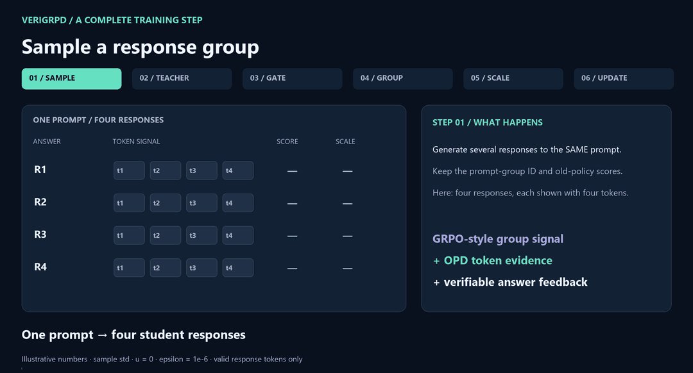
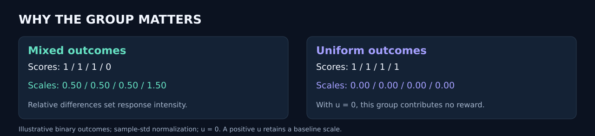

# VeriGRPD: a training step, explained

**Verifier-Guided Group-Relative Policy Distillation** combines sampled-token teacher evidence, answer verification, and GRPO-style within-prompt scaling. This walkthrough describes the archived gate-plus-group implementation. Its policy optimizer is GSPO-token; the public direct-KL ordinal trainer is a separate path.

## Follow one response group



The four responses, token evidence, and binary outcomes below are **synthetic teaching examples**, not measurements from the benchmark tables. The archived group preset defaults to eight responses; four are drawn for legibility. All shown tokens are valid response tokens.

| Stage | Computation | Static view |
| :-- | :-- | :-- |
| 1. Sample | Generate multiple responses to one prompt. Preserve group IDs and old-policy token scores. | [Sampling](assets/verigrpd-step-1.png) |
| 2. Teacher evidence | At each sampled prefix, subtract the student's sampled-token log probability from the teacher's. | [Evidence](assets/verigrpd-step-2.png) |
| 3. Verify and gate | Sum the verifier score for each answer. Above the correctness threshold, keep positive evidence; otherwise keep negative evidence. | [Gate](assets/verigrpd-step-3.png) |
| 4. Group comparison | Center outcome scores within the prompt group and optionally divide by sample standard deviation plus epsilon. | [Group](assets/verigrpd-step-4.png) |
| 5. Scale | Multiply each response's gated token evidence by the absolute group advantage plus baseline `u`. | [Scale](assets/verigrpd-step-5.png) |
| 6. Update | Detach the token rewards and use them in the archived GSPO-token policy objective. | [Update](assets/verigrpd-step-6.png) |

## A numerical example

Use outcome scores `[1, 1, 1, 0]`, sample-standard-deviation normalization, `epsilon = 1e-6`, and baseline `u = 0`.

```text
group mean       = 0.75
sample std       = 0.50
advantage[i]     = (score[i] - 0.75) / (0.50 + 1e-6)
scale[i]         = abs(advantage[i]) + u
displayed scales = [0.50, 0.50, 0.50, 1.50]
```

Values in the figures are rounded to two decimals. For a correct response with evidence `[+0.80, -0.40, +0.20, -0.60]`, the gate gives `[+0.80, 0, +0.20, 0]`; scaling gives approximately `[+0.40, 0, +0.10, 0]`. For the incorrect response with `[+0.60, -0.40, +0.80, -0.20]`, the gate gives `[0, -0.40, 0, -0.20]`; scaling gives approximately `[0, -0.60, 0, -0.30]`.

**The absolute advantage controls intensity.** It does not flip negative gated rewards into positive ones. A larger scale is not a guarantee of a larger parameter change: policy clipping, masks, and aggregation also matter.

## Why mixed and uniform groups differ



Identical group outcomes give zero centered advantages. With `u = 0`, their scaled distillation rewards are zero. With a positive `u`, they retain that baseline intensity. If standard-deviation normalization is disabled, the example's centered advantages are `[0.25, 0.25, 0.25, -0.75]` instead.

## Implementation references

- [Gate and group scaling](../verl/verl/trainer/ppo/ray_trainer.py): correctness clamp precedes the absolute-advantage multiplier.
- [Group advantage calculation](../verl/verl/trainer/ppo/core_algos.py): `compute_grpo_outcome_advantage` groups verifier scores by prompt ID and uses sample standard deviation.
- [Archived launcher](../scripts/train_policy_archive.sh): the `group` preset enables group scaling and standard-deviation normalization.
- [GSPO-token update rule](GSPO_TOKEN.md): shared sequence-ratio values with local token gradients.
- [Current direct-KL method](DIRECT_OPD.md): a distinct objective, without a verifier in training.

[Back to the README](../README.md#verigrpd-step-by-step)
